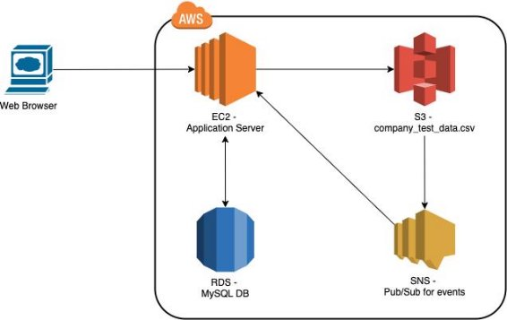
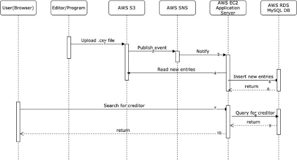

**Creaditor Search Application**

**Application Architecture**

- Topology

Figure 1 Topology and services in use

- Sequence diagram

Figure 2 Sequence diagram

1. The editor who edits new credito entries or the program that collects these entries from the Internet uploads the new company\_test\_data.csv to AWS S3 bucket.
1. Once the AWS S3 bucket gets a new csv file uploaded, it publishes a new object event to AWS SNS topic.
1. SNS notifies the http endpoint that subscribes to the same topic. This endpoint is hosted at the search application server.
1. The search application is aware of a new csv file and reads new entries from it.
1. Search application inserts new entries into MySQL database.
1. Search application gets response from MySQL database about the insertions.
1. A user types part of a creditor’s name in the search box.
1. Search application takes whatever user types and makes a sql query to MySQL database.
1. MySQL database returns the query results to the search application. 10.Search application returns a list of creditors’ names that contain the keyword which the user types in.

**Design Details**

- DB and its schema

We choose MySQL as our database. The rationale behind this is we only search creditors by their names. We can leverage the ‘like’ feature of a relational database. In addition, we choose Spring Boot and its JPA data as the application framework. JPA data has very good integration with hibernate and relational databases.  Furthermore, newer versions of MySQL also have the cluster feature and the document store which are the main characteristics we usually find from a NoSQL database. So why not MySQL? Since we only care for creditors, we create a table to store them and the below is the creditor table definition

|Column|Type|comments|
| - | - | - |
|id|int(11)|Primary key|
|creditor\_name|varchar(80)||
|attention|varchar(50)||
|address1|varchar(60)||
|address2|varchar(50)||
|city|varchar(45)||
|state|varchar(10)||

|postal\_zip|varchar(20)||
| - | - | :- |
To enhance the search experience, we can add an additional column “click\_through\_count”. This column keeps track of count that different users ever click through to the detail of the entry. This shows what people are interested in and care about. With this column, we can sort the query results by alphabetical order of name and this count. This will be more relevant to the query results. However, this is not implemented yet.

Another thing to enhance the search experience is to add a search\_frequency table like this:

|Column|Type|comments|
| - | - | - |
|id|int(11)|Primary key|
|term|varchar(60)||
|count|int(11)||
This table stores what terms that users ever search for and its frequency. So when a user wants to search for a term like “be”, the search box lists down suggestions that start with “be” based on its frequency. The frequency comes from search\_frequency table. This is not implemented, either.

- Coding principle

The application is hosted at <http://ec2-54-65-186-213.ap-northeast-1.compute.amazonaws.com:8080/> . We use Java as the programming language and Spring Boot as the framework. Spring Boot is 100% compatible with Spring. However, it simplifies the way we configure Java beans and instances using XML. Instead, the same goal can be achieved by annotations. In addition, it removes the need for writing boilerplate codes. By defining only the entity and the JPA repository for the creditor, the CRUD rest api is ready to serve. If we want to add additional or customized api, we simply add method declarations in the interface by following the naming conventions and they will work as we expect.  The Spring Boot also follows controller - service - dao hash

ion. If we still want to customize our rest controller, service, and repositories, those are doable. We can also switch to another JPA implementation without changing the codes in service layer. So it’s extensible and highly maintainable.

- Event driven

The project condition is to pull source data hosted in AWS S3. Thus, we can leverage AWS SNS as the event driven system, as illustrated in Figure 2. We create a topic in SNS and let S3 bucket be the publisher of the topic and http endpoint as the subscriber. Whenever a new csv file is uploaded to the bucket, the S3 will publish an event to the SNS topic. SNS will further notify subscribers that subscribe to the topic. In our case, the http endpoint hosted at our search application will get this notification, pull data from S3, parse the data and insert new entries into MySQL database.

- Frontend

Another project condition is to use React JS to create web UI. The beauty of React is that it realizes the single page development. It also eases the pains of complicated JavaScript code with concise coding style and expression and still has the object-oriented feature. It also uses states to reflect what should be rendered in the UI. I would strongly recommend to develop React program with Redux because Reux does better state management and it’s more event driven.

- API documentation

We use swagger as API documentation and it’s available at [http://ec2-54-65-186-213.ap-northeast-1.compute.amazonaws.com:8080/swa gger-ui.html](http://ec2-54-65-186-213.ap-northeast-1.compute.amazonaws.com:8080/swagger-ui.html) . With swagger, we don’t need to write additional code to come up with this documentation. All we need is to add maven dependencies and add some configuration beans. It will scan all the rest service calls we have. With swagger, client side or front end developers can test the API easily and have better knowledge about what’s available in the first place.

- ElasticSearch

It’s also very handy to switch to ElasticSearch in Spring boot and JPA. We just let CreditorElasticSearchRepository interface to extend ElasticSearchRepositor and that’s it. For CreditorElasticSearchRepository and CreditorRepository to share the same set of customized methods, we create another Interface named IRepository and let both interfaces extend it. That way, when switching between these two repositories, there is no need to modify the code in service layer and make it highly maintainable. Due to time limitation, the CreditorElasticSearchRepository is not fully tested yet.
